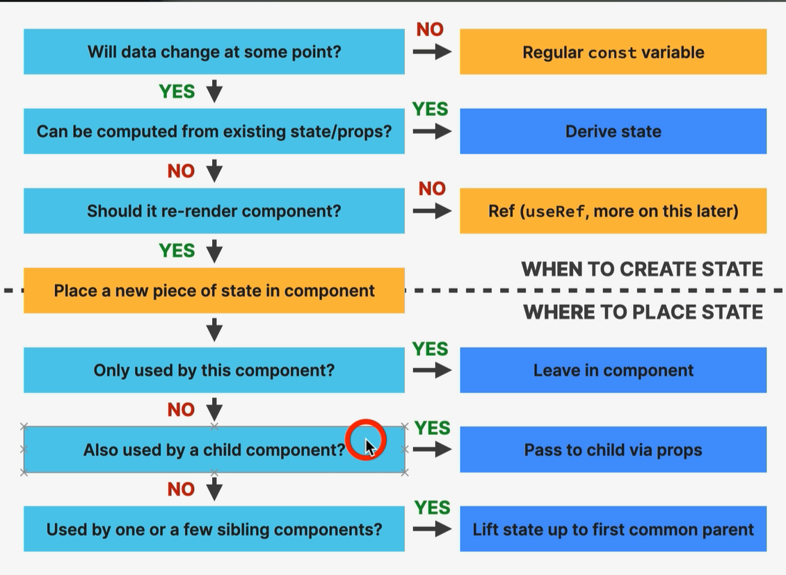
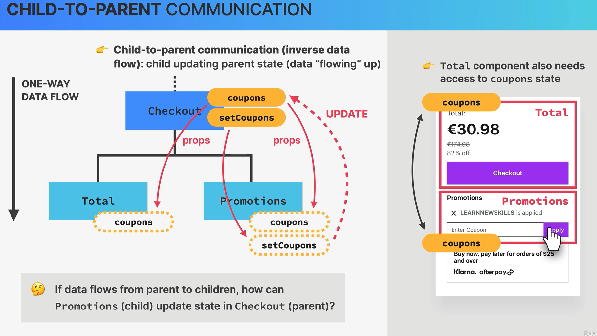

# Travel List

## Managing State

- Deciding how to use state:
  
- [Lifting up state](https://legacy.reactjs.org/docs/lifting-state-up.html)
  - Move the state (and its setting function) to the closest parent both sibling components have in common and pass the data down using props.
- State is transferred in a one-way data flow in React.
- Child to parent communication. This works by passing the state setter function to the child component whilst the state is defined and stored in the parent component. This work around allows the child component to update the parent state. (data flowing up work around).
  
